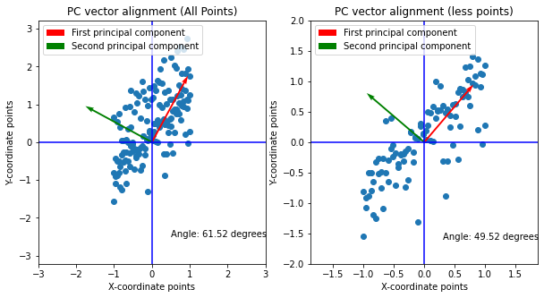
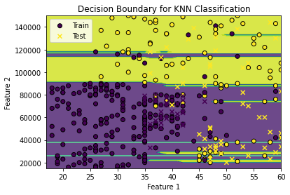

# Metal/Non-Metal Classification + Debye Temperature Prediction (From Scratch)
This repository contains an end-to-end machine learning pipeline for materials property prediction.

The main objective of this project was to develop a complete machine learning pipeline to:

1. **Classify materials into Metals and Non-metals**
2. **Predict the Debye Temperature of metals**

To achieve this, the dataset was transformed into an ML-ready format using a full preprocessing pipeline including:

- Feature selection
- Handling missing values
- Label/ordinal/one-hot encoding
- Composition-based feature engineering
- Dimensionality reduction using PCA

Since all models and supporting utilities were implemented **from scratch using only NumPy and Matplotlib**, this work demonstrates a strong understanding of core concepts including:

- Data preprocessing and feature engineering
- PCA mathematics and eigen-decomposition
- Classification/regression algorithms
- Optimization (SGD, Momentum, RMSProp, Adam)
- Model evaluation metrics
- Testing and validation using PyTest (unit + integration + functional tests)
  
The workflow includes feature engineering (descriptors), encoding, dimensionality reduction (PCA), and testing (unit + functional) using PyTest.
Full report and results: [ppp_report.pdf](ppp_report.pdf)

## Project Goals
 - Convert raw chemical compound information into usable machine learning descriptors
 - Build classification and regression models using pure Python implementations
 - Evaluate performance using standard ML metrics
 - Ensure reliability using unit tests and functional/integration tests
 - Support both model development + validation workflows

## Implemented Tasks
 - Descriptor generation
 - Encodings
 - Principal Component Analysis (PCA)
 - Classification and regression models (NumPy-based)
 - ANN optimization algorithms
 - Unit & functional testing (PyTest)
 - Hyperparameter tuning
 - Gradient check for ANN backpropagation

## Repository Structure (with explanations)

```text
├── main.py
│   └── Runs the full pipeline end-to-end (classification + regression)
│
├── input_file_regression.csv
│   └── Main dataset used for regression (Debye temperature prediction)
│
├── non_zero_columns.csv
│   └── Stores filtered feature list used after preprocessing/PCA
│
├── report.pdf
│   └── Full documentation: theory, methodology, models, results, scaling tests
│
├── data_preprocessing/
│   ├── raw_compounds_data.csv
│   ├── Elements_data.csv / Elements_data_updated.csv
│   ├── compounds_to_element_count.py
│   ├── label_encoding.py
│   ├── one_hot_encode_ele_composition.py
│   ├── Desc1_comp_to_ind_ele.py
│   ├── Desc2_weighted_atomic_properties.py
│   └── ...
│   └── Converts raw compound strings into ML-ready numeric features
│
├── pca/
│   ├── pca.py
│   ├── compare_biplot_pca.py
│   └── prinical_component_vector_alignment_check.py
│   └── PCA implementation + verification and visualization
│
├── Multiple_linear_regression/
│   └── multiple_linear_regression.py
│   └── Regression baseline model for predicting Debye temperature
│
├── knn/
│   └── knn_classification.py
│   └── KNN classifier implementation + tuning utilities
│
├── Decision_tree_based_models/
│   ├── classification_and_regression_tree.py
│   ├── random_forest_classification.py
│   ├── gradient_boosting_regression.py
│   └── Tree-based ML models:
│       - Random Forest (classification)
│       - Gradient Boosting (regression)
│
├── ANN/
│   ├── ANN_classification.py
│   ├── ANN_regression.py
│   ├── optimization_algorithms.py
│   ├── hyperparameter_tuning.py
│   └── Neural network models (classification + regression)
│
└── Testing/
    ├── Data_preprocessing_testing/
    ├── ANN_testing/
    ├── Evaluation_metrics_testing/
    ├── Functional_testing/
    ├── pca_testing/
    └── ...
    └── Complete unit + functional test suite using pytest
```
## Requirements
This project uses Python and standard scientific libraries.

Install dependencies using:
```bash
pip install -r requirements.txt
```
Tested with:
 - Python 3.10.7
 - NumPy, Matplotlib, PyTest
## How to Run the Full Project
From the project root:
```bash
python main.py
```
This will execute the full workflow:
 - preprocessing → descriptors → encoding → PCA → training → evaluation
## Testing (Unit + Functional + Integrated Testing)
This repository contains an extensive PyTest suite for validating each pipeline stage.
Testing is a major focus of this project and is documented in detail in the report.

## Run all tests
```bash
pytest
```
## Testing in detail
This project contains a complete test suite implemented using **PyTest** to validate correctness of the full pipeline.
### 1) Data Preprocessing & Feature Engineering Tests
The preprocessing module is tested using:
- **Unit tests**: verify individual preprocessing functions  
- **Integration tests**: verify full preprocessing pipeline outputs  
**Approach**:
- Inputs are provided using predefined test datasets
- Outputs are compared against expected results
- `pytest` assertions validate correctness

---

### 2) PCA Testing

PCA correctness is verified using two validation strategies:
- **Principal Component Vector Alignment Test**
  - Synthetic 2D dataset is created with a clear dominant variance direction
  - PC1 direction is computed
  - High-offset points are removed
  - PC1 angle shift and alignment improvements are observed

  This confirms that PC1 points towards the maximum-variance direction.
- **Variance Preservation Check**
  - Sum of eigenvalues of the covariance matrix ≈ total dataset variance
  - 
  This confirms that PCA correctly captures the total dataset variance.
---
### 3) KNN Testing

KNN functionality is tested by:

- Manually computing distances between points
- Sorting nearest neighbors
- Comparing expected labels with model-predicted labels

**Additional verification**
- **Decision boundary plotting**

  - The KNN decision surface is plotted using a sample dataset
  - This visually validates that classification regions behave as expected

---

### 4) ANN Testing (Neural Networks)

ANN tests include:

- **Forward pass validation**
  - Compare ANN outputs against known precomputed outputs
  - Validate activation function outputs

- **Gradient checking for backpropagation**
  - Perturb weights using a small epsilon value (ε = 1e−4)
  - Compute numerical gradients using finite differences
  - Compare numerical gradients with analytical backpropagation gradients
  - Small gradient error confirms correct implementation

This gradient-check step is critical because small derivative mistakes can make training unstable or incorrect.

---

### 5) Random Forest + Tree Model Testing

Tree-based classification correctness is verified using:

- **Decision boundary plots**

  - Ensures model behavior is consistent with expected region separation
  - Confirms correct classification logic and decision splitting behavior

---

### 6) Regression Model Functional Testing

Regression models (Multiple Linear Regression, ANN Regression, Gradient Boosting Regression) are tested using a controlled dataset:

- Independent features include fixed and varying signals
- Target output is generated using a known function (example: `y = n * 2`)
- Model predictions must match expected outputs within a defined tolerance

This verifies end-to-end regression correctness beyond only training accuracy.
## Results

This project consists of two main stages:

1. **Classification Task**  
   Predict whether a material is **Metal** or **Non-metal**.

2. **Regression Task (Metals only)**  
   Predict the **Debye Temperature** of metallic compounds using ML models.

---

### 1) Classification Results (Metal vs Non-metal)

Three classification models were implemented and evaluated:

| Model | F1 Score | Recall | Precision | Accuracy |
|------|----------|--------|-----------|----------|
| ANN Classification | 0.929 | 0.928 | 0.930 | 90.01% |
| KNN Classification | 0.924 | 0.926 | 0.922 | 89.29% |
| Random Forest Classification | 0.754 | 0.808 | 0.706 | 62.74% |

**Best classifier:** **ANN Classification**  
It achieved the highest performance across F1 Score, Precision, Recall, and Accuracy.

---

### 2) Regression Results (Debye Temperature Prediction)

Regression was performed only on samples classified as **Metals**.  
Three regression models were evaluated:

| Model | RMSE | MAE | R² |
|------|------|-----|----|
| Gradient Boosting Regression | 0.378 | 0.255 | 0.89 |
| ANN Regression | 0.532 | 0.304 | 0.784 |
| Multiple Linear Regression (MLR) | 0.440 | 0.257 | 0.852 |

**Best regression model:** **Gradient Boosting Regression**  
It achieved the **lowest RMSE**, **lowest MAE**, and the **highest R² (0.89)**.

---

### Overall Summary

- The **ANN model** performed best for **classification**
- The **Gradient Boosting model** performed best for **regression**
- The pipeline successfully:
  - Identifies **metals vs non-metals**
  - Predicts **Debye temperature** for metals using engineered features + PCA


